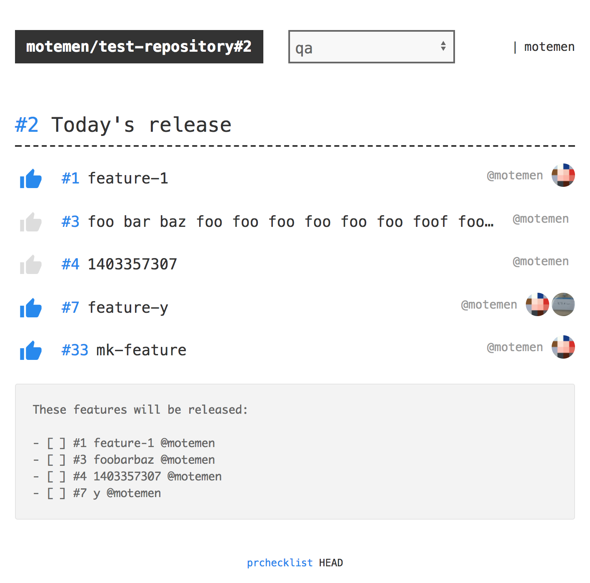

# prchecklist  

Checklist for "release" pull requests, which includes feature pull requests to merge into mainline

[Demo](https://prchecklist.herokuapp.com/motemen/test-repository/pull/2)

## Features

- Provides checklists base on "release" pull requests which have multiple "feature" pull requests that are about to merged into master by the "release" one (see the demo)
- Each checklist item can be checked by GitHub accounts who have access to the repository
- Checklists can have multiple stages (eg. QA and production)
- Notifies to Slack on each check or checklist completion
- Customizable by a .yml file on repositories

## Configuration

By a file named `prchecklist.yml` on the top of the repository you can customize prchecklist's behavior.

For example it seems like:

~~~yaml
stages:
  - qa
  - production
notification:
  events:
    on_check:
      - ch_check
    on_complete:
      - ch_complete
  channels:
    ch_complete:
      url: https://hooks.slack.com/services/XXXXXXXXX/XXXXXXXXX/XXXXXXXXXXXXXXXXXXXXXXXX
    ch_check:
      url: https://hooks.slack.com/services/XXXXXXXXX/XXXXXXXXX/XXXXXXXXXXXXXXXXXXXXXXXX
~~~

This configuration says:

- This repository has two stages (qa, production), which means two checklists are created for each release pull requests,
- And when a checklist item is checked, a Slack notification is sent,
- And when a checklist is completed, a Slack notification is sent to another Slack channel.

## Development

Requires [Go][] and [yarn][].

Register an OAuth application [on GitHub](https://github.com/settings/applications/new), with callback URL configured as `http://localhost:8080/auth/callback`. Set OAuth client ID/secret as `GITHUB_CLIENT_ID`, `GITHUB_CLIENT_SECRET` environment variables respectively.

    $ make develop
    $ open http://localhost:8080/

## Building

    $ make # builds "prchecklist" stand-alone binary

## Releases

Release binaries are on [Releases page](https://github.com/motemen/prchecklist/releases). They are uploaded by [Travis CI](https://travis-ci.org/motemen/prchecklist).

[Go]: https://golang.org/
[yarn]: https://yarnpkg.com/

## Author

motemen, with great support of [Hatena](http://hatenacorp.jp/) folks.
